# Configuration

## How the Keycloak was setup to mimic the Helmholtz AAI

### Start the docker compose setup

- Start docker compose setup

  - `docker compose up -d`

- visit: http://keycloak:`KEYCLOAK_PORT`
  - login using
    - username: `admin`
    - password: `admin`
  - **Note** these are set by the environment variables `KEYCLOAK_ADMIN` and `KEYCLOAK_ADMIN_PASSWORD`

### Create a realm

- click the drop-down-menu on the left side (right under the header) where currently `Keycloak` is selected
  - click the button `Create realm`
- name it `local-dev`
- click `create`
- **Note** The images here use the realm name `demo` instead of `local-dev`. You can name it as you like - as long as you use the right realm name in your client applications configuration.
  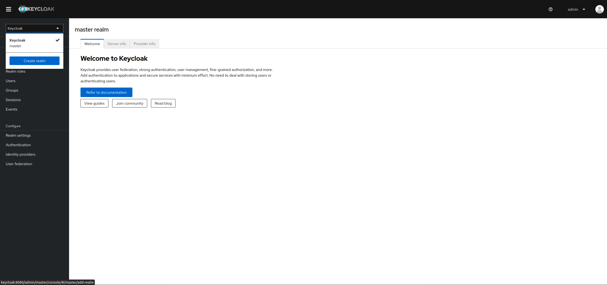
  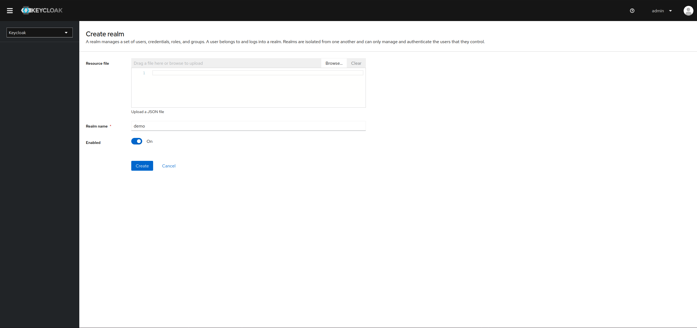

### Create a client communicating over backend channel

- go to `clients` in left menu
- click `create client`
- fill in the form (see pictures)
- **Note** It is important to set the `Client authentication` **on** for the client to enable the authentication over the backend channel

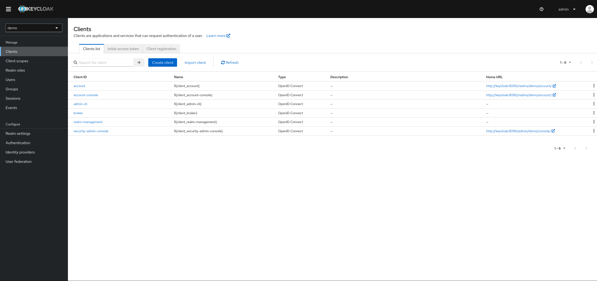
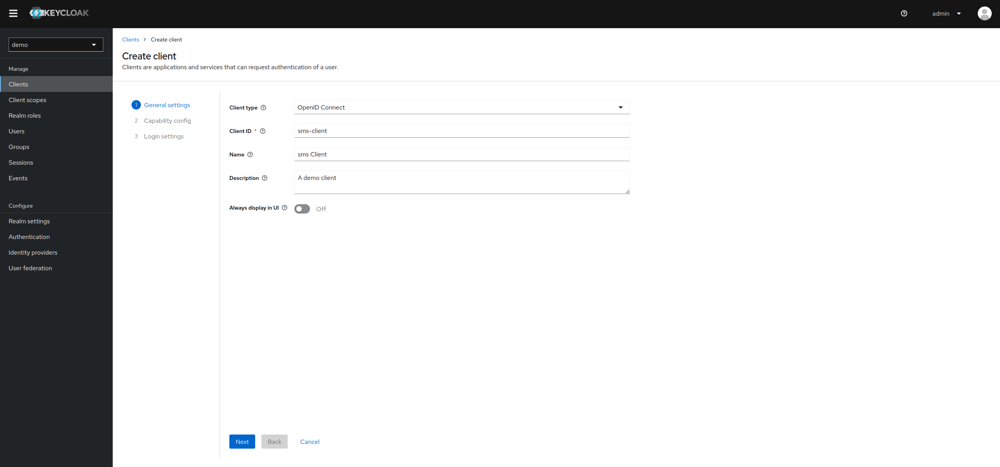
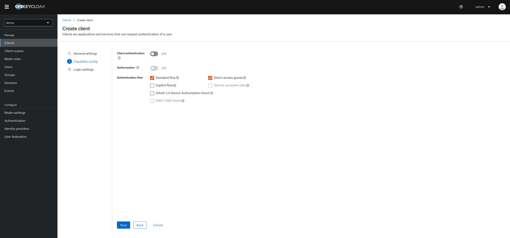
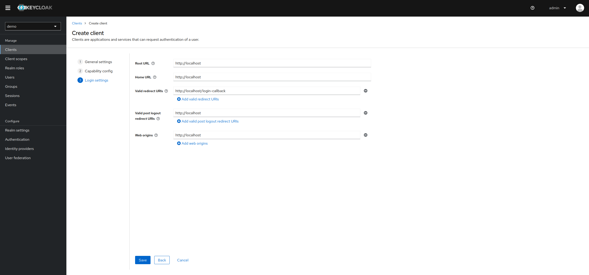

### Create client scopes

- these scopes will be needed to mock some properties of the helmholtz aai
- you will need the scopes `openid`, `eduperson_entitlement`, `eduperson_principle_name`, `eduperson_unique_id`
- go to `client scopes` in left menu

#### `openid` scope:

- **Note** This scope is needed (and must also be send by the client) to provide access to the `userinfo` endpoint
- click `create client scope`
  - name: openid
  - Type: Default


#### `eduperson_principal_name` scope

- click `create client scope`
  - name: `eduperson_principal_name`
  - Type: default
- add mapper to `eduperson_principal_name` scope
  - **After save**: Go to the `Mapper` tab of the saved scope
  - click `Configure a new mapper`
  - Select `user property`
  - Fill in the form:
    - Name: `Mapper eduperson_principal_name`
    - Property: `username`
    - token claim name: `eduperson_principal_name`

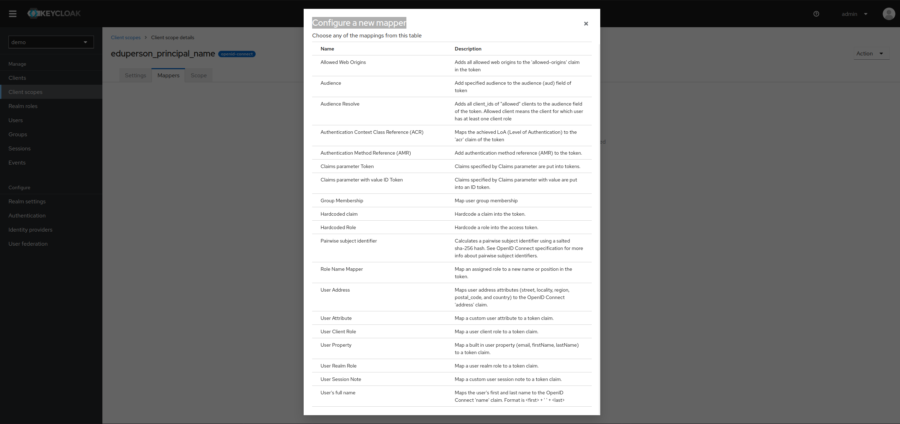
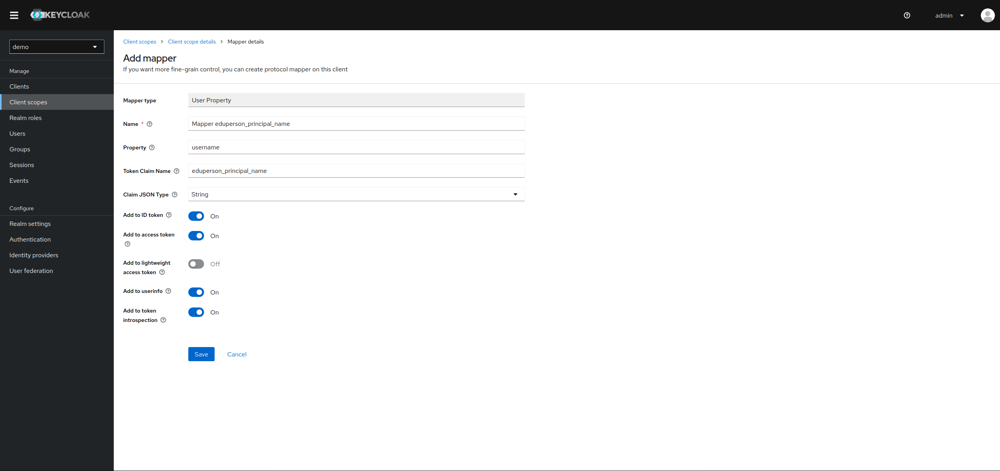

#### `eduperson_entitlement` scope

- click `create client scope`
  - name: `eduperson_entitlement`
  - Type: default
- add mapper to `eduperson_entitlement` scope
  - **After save**: Go to the `Mapper` tab of the saved scope
  - click `Configure a new mapper`
  - Select `Group Membership`
  - Fill in the form:
    - Name: `Mapper eduperson_entitlement`
    - token claim name: `eduperson_entitlement`
    - full group path: `off`

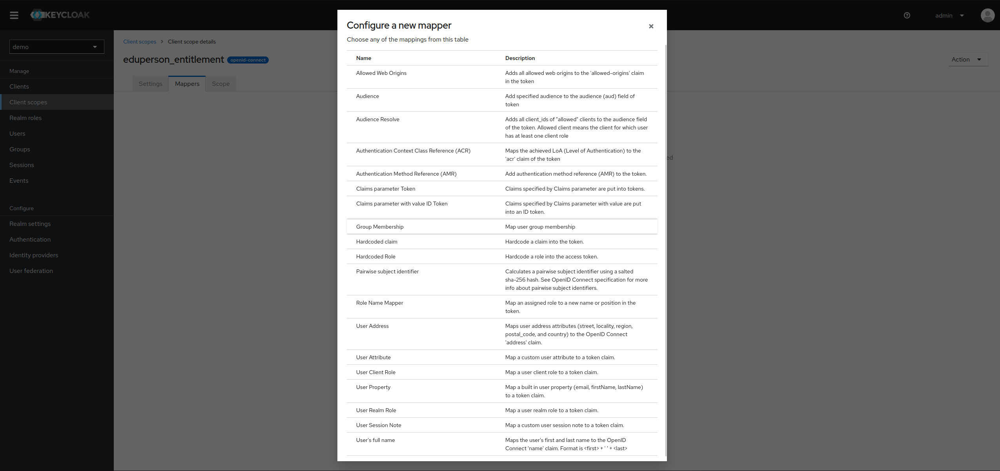


#### `eduperson_unique_id` scope

- click `create client scope`
  - name: `eduperson_unique_id`
  - Type: default
- add mapper to `eduperson_unique_id` scope
  - **After save**: Go to the `Mapper` tab of the saved scope
  - click `Configure a new mapper`
  - Select `user property`
  - Fill in the form:
    - Name: `Mapper eduperson_unique_id`
    - Property: `id`
    - token claim name: `eduperson_unique_id`
      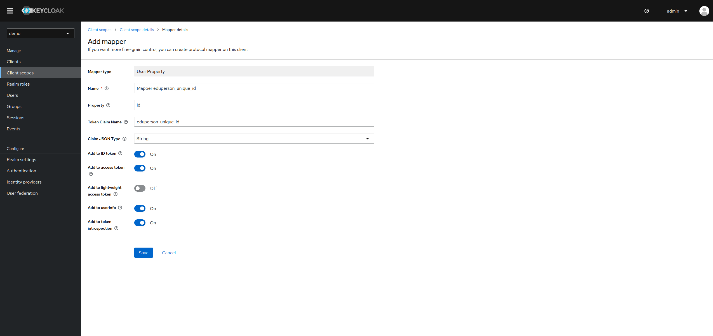

### Add the scopes to your client

- go to `clients` in left menu
- select you client, e.g. `dev-client`
- go to `client scopes` tab
- click `add client scope`
- select the previously created ones
  - select type: `default`

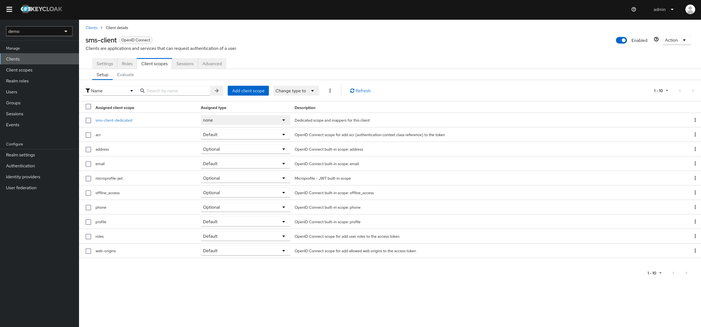
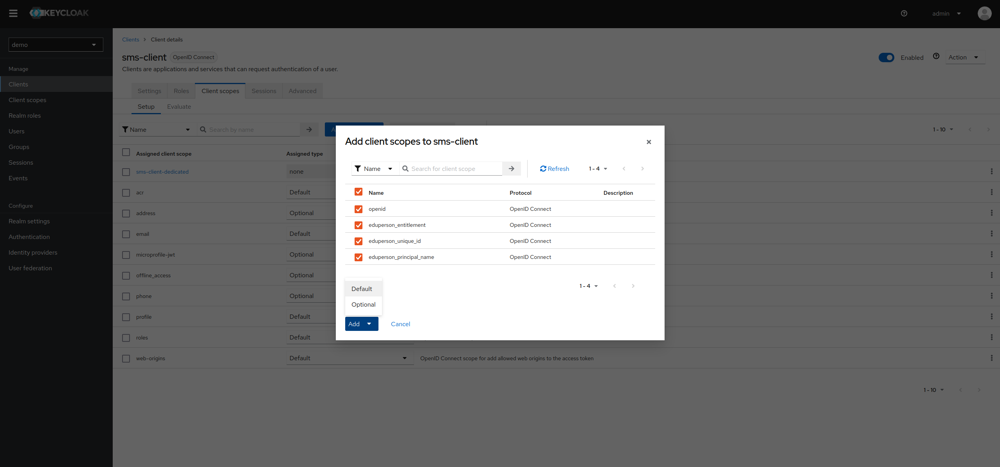

### Create a group

- you can adopt the procedure to create more
- **Note**
  - The original Helmholtz Virtual Organization groups look something like this: `urn:geant:helmholtz.de:group:VO-Name:group-name#login.helmholtz.de`, so the name of the groups must follow the naming schema
- go to `Groups` in left menu
- click `create group`
- fill in the form:
  - Name: `a:a:a:group:VO:Group1#`

### Create a user

- you can adopt the procedure to create more
- go to `Users` in left menu
- click `Create new user`
- fill in the form:
  - Email verified: `yes`
    - **Note** This is import to set to `yes` otherwise the user has to confirm its email adress
  - username: `user1`
  - email: `user1@provider.org`
  - first name: `User1`
  - last name `One`
  - Groups:
    - click `join groups`
    - selected the previous created group
    - click `join`
  - click `create`

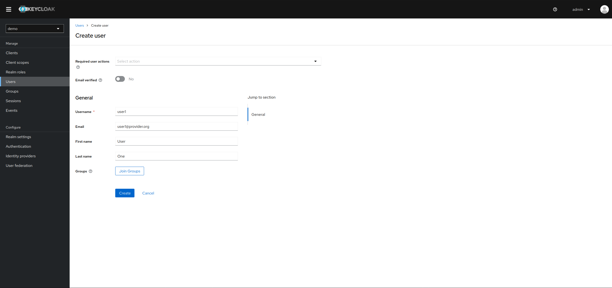

#### Add user credentials

- **After create**: Go to `credentials` tab
  - click `Set password`
  - fill in the form:
    - Password: `password`
    - Password confirmation: `password`
    - Temporary: `Off`
      - **Note**: If you set this to `on` the user has to update its password on first login. With off you can use the dummy password everytime

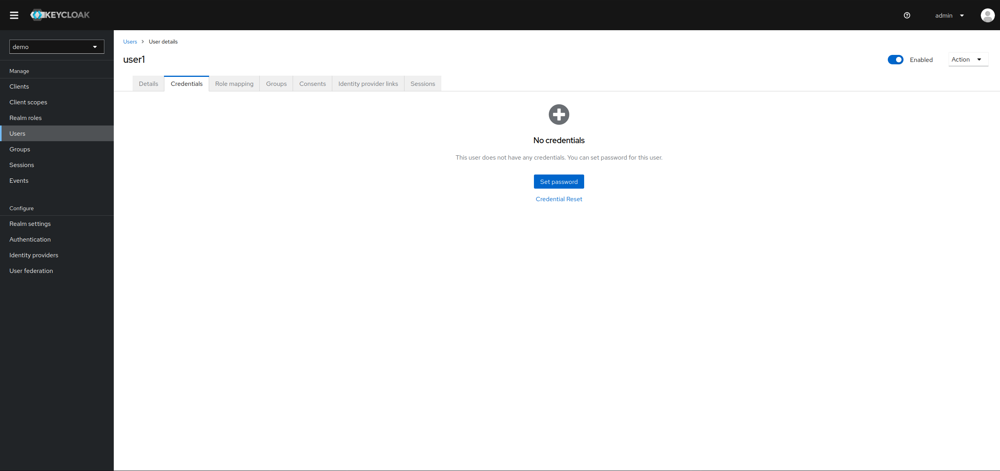

### Update Authentication flow

- go to `Authentication` in left menu
- click on `browser`
- Set `Requirement` for `Cookie` to `Disabled

**Reason for doing this**:

If the cookie is disabled, you have to enter a password everytime you login. This is important, because otherwise it would not be possible to change the user. And it's acutal the same behavior as the aai.

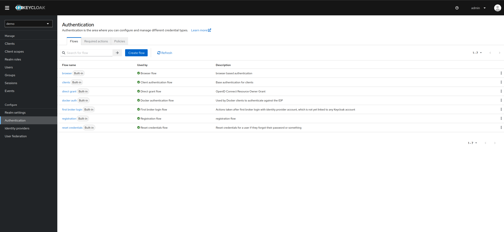
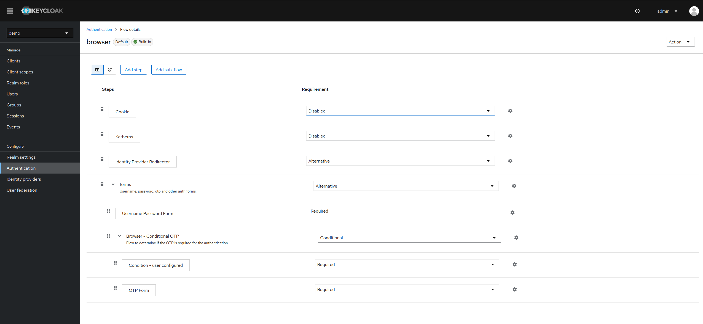

### Update SSO Session Max

- go to `Realm Settings` in left menu
- click on tab `Sessions`
- Set `SSO Session Max` to `10` `Seconds`

**Reason for doing this**:
There was a problem, when you logged in with one user in the application and then logged out and tried to login with another user:

```
You are already authenticated as different user 'user1' in this session. Please sign out first.
```

This change fixes this.

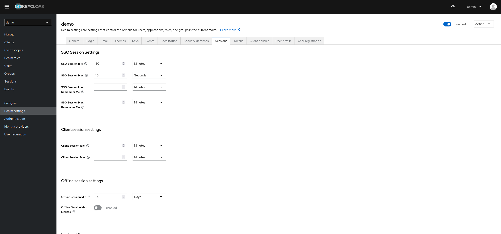

### Lightweight Access token

- go to clients
- select `dev-client`
- go to `Advanced` tab
- scroll to section `Advanced settings`
- check `Always use lightweight access token`

### Audition fix

Keycloak does not out-of-the-box add the `client_id` to the `aud` claim, so you need to add it by yourself

- Select realm `local-dev`
- Go to `Client scopes`
- click `Create client scope` button
  - name: `dev-client-audience`
  - description: `Correct map the client_id to the aud claim`
  - Type: `Optional`
  - make sure that `Include in token scope` is checked on
- `Add mapper` > `By configuration`
  - Select `Audience`
  - name: `dev-client-audience mapper`
  - make sure that `Add to lightweight access token` is checked on

It should be set to type `Default` in the `dev-client`:

- Go to `clients` > `dev-clients` > `Client scopes`
- search for `dev-client-audience` and change the `Assigned type` to `Default`

### Export the settings to an file

- this file can be used to start the keycloak server and fill it with some initial data
  - prerequisite - docker compose work:
    - first create a ` keycloak-init.json` in you local docker compose setup
    - mount it to the keycloak service using volumes
    - ```yaml
      volumes:
        - "./keycloak/keycloak-init.json:/opt/keycloak/data/import/keycloak-init.json"
      ```
  - Run the following command to export the file

```bash
docker compose -f "./docker-compose.yml" --env-file "./docker/env.dev" exec keycloak /opt/keycloak/bin/kc.sh export --file /opt/keycloak/data/import/keycloak-init.json --users same_file --realm local-dev

or

docker compose exec keycloak /opt/keycloak/bin/kc.sh export --file /opt/keycloak/data/import/keycloak-init.json --users same_file --realm local-dev
```

- to use that file on start use the following service command in the `docker-compose.yml`
- ```yaml
  command:
    - start-dev
    - --import-realm
  ```

- **Important/Troubleshooting export file**

  - If you export the json file it could be possible that you could have some problems, when you start the keycloak using it

  - See: https://howtodoinjava.com/devops/keycloak-script-upload-is-disabled/

  - To solve the problem:

    - > So, to solve the “Script upload is disabled” error **clean the realm JSON file by removing the ‘`authorizationSettings`‘ node** altogether. After cleaning the realm file, the import will run successfully and the server will start.
