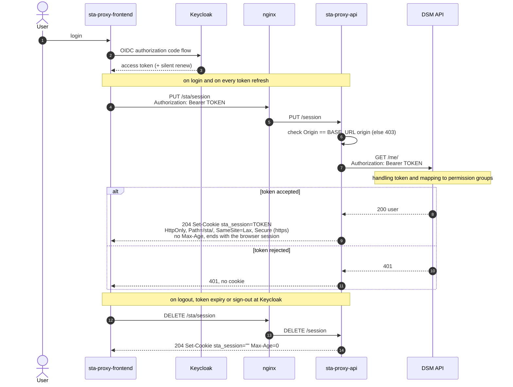
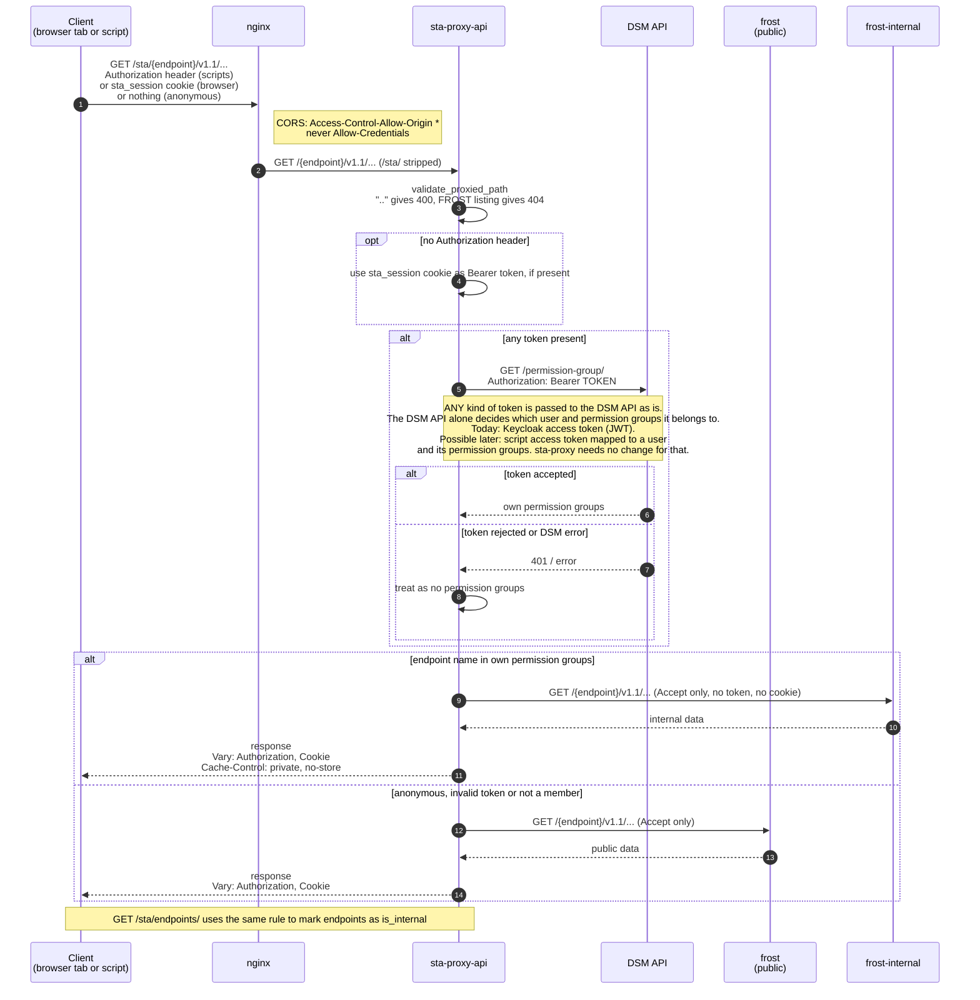

# STA Proxy

## Session handling

```mermaid
sequenceDiagram
    autonumber
    actor U as User
    participant FE as sta-proxy-frontend
    participant KC as Keycloak
    participant N as nginx
    participant API as sta-proxy-api
    participant DSM as DSM API

    U->>FE: login
    FE->>KC: OIDC authorization code flow
    KC-->>FE: access token (+ silent renew)

    Note over FE,API: on login and on every token refresh
    FE->>N: PUT /sta/session<br/>Authorization: Bearer TOKEN
    N->>API: PUT /session
    API->>API: check Origin == BASE_URL origin (else 403)
    API->>DSM: GET /me/<br/>Authorization: Bearer TOKEN
    Note over DSM: handling token and mapping to permission groups
    alt token accepted
        DSM-->>API: 200 user
        API-->>FE: 204 Set-Cookie sta_session=TOKEN<br/>HttpOnly, Path=/sta/, SameSite=Lax, Secure (https)<br/>no Max-Age, ends with the browser session
    else token rejected
        DSM-->>API: 401
        API-->>FE: 401, no cookie
    end

    Note over FE,API: on logout, token expiry or sign-out at Keycloak
    FE->>N: DELETE /sta/session
    N->>API: DELETE /session
    API-->>FE: 204 Set-Cookie sta_session="" Max-Age=0
```

## Request workflow

```mermaid
sequenceDiagram
    autonumber
    participant C as Client<br/>(browser tab or script)
    participant N as nginx
    participant API as sta-proxy-api
    participant DSM as DSM API
    participant FP as frost<br/>(public)
    participant FI as frost-internal

    C->>N: GET /sta/{endpoint}/v1.1/...<br/>Authorization header (scripts)<br/>or sta_session cookie (browser)<br/>or nothing (anonymous)
    Note right of N: CORS: Access-Control-Allow-Origin *<br/>never Allow-Credentials
    N->>API: GET /{endpoint}/v1.1/... (/sta/ stripped)
    API->>API: validate_proxied_path<br/>".." gives 400, FROST listing gives 404

    opt no Authorization header
        API->>API: use sta_session cookie as Bearer token, if present
    end

    alt any token present
        API->>DSM: GET /permission-group/<br/>Authorization: Bearer TOKEN
        Note over API,DSM: ANY kind of token is passed to the DSM API as is.<br/>The DSM API alone decides which user and permission groups it belongs to.<br/>Today: Keycloak access token (JWT).<br/>Possible later: script access token mapped to a user<br/>and its permission groups. sta-proxy needs no change for that.
        alt token accepted
            DSM-->>API: own permission groups
        else token rejected or DSM error
            DSM-->>API: 401 / error
            API->>API: treat as no permission groups
        end
    end

    alt endpoint name in own permission groups
        API->>FI: GET /{endpoint}/v1.1/... (Accept only, no token, no cookie)
        FI-->>API: internal data
        API-->>C: response<br/>Vary: Authorization, Cookie<br/>Cache-Control: private, no-store
    else anonymous, invalid token or not a member
        API->>FP: GET /{endpoint}/v1.1/... (Accept only)
        FP-->>API: public data
        API-->>C: response<br/>Vary: Authorization, Cookie
    end

    Note over C,API: GET /sta/endpoints/ uses the same rule to mark endpoints as is_internal
```
